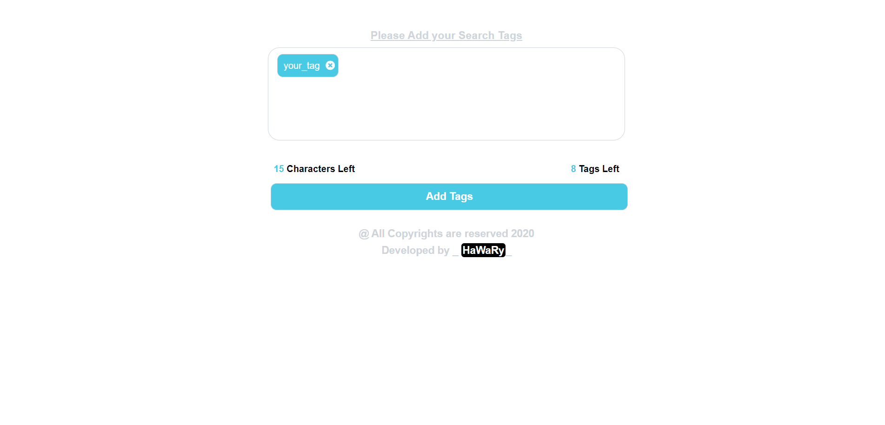

# Add Tags

Add Tags is a Box Engine let you add your Search Tags for your Project and control them like Twitter. 
  

## Getting Started

You can try the APP from [here](https://mohamed-elhawary.github.io/add-tags/)

## Prerequisites

Just Modern Browser like "Chrome" and a Code Editor for Deployment and Develop.

## Built With

* HML5
* CSS3
* JS including the use of of Regex "Regular Expressions".  

## Libraries  

* [jQuery](https://jquery.com/)  

* [FontAwesome](https://fontawesome.com/)

## Author

* Mohamed Elhawary  

## Contact Me  

* Email: mohamed.k.elhawary@gmail.com

## Deploy with Me

Feel Free to Deploy it with me, send Issues or a Pull Request and i'll deal with you, just test it First.

## License

Licensed under the [MIT License](LICENSE)

